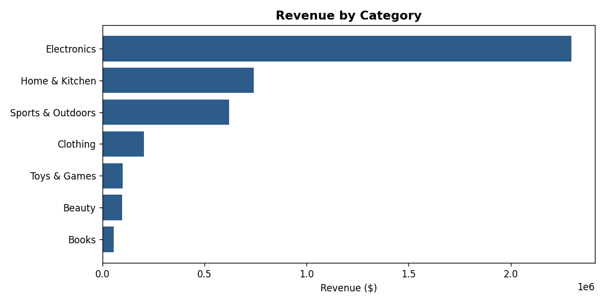
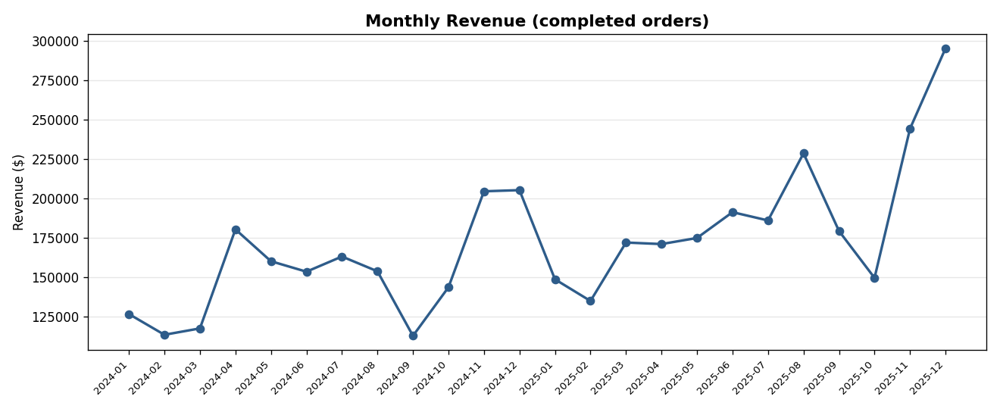
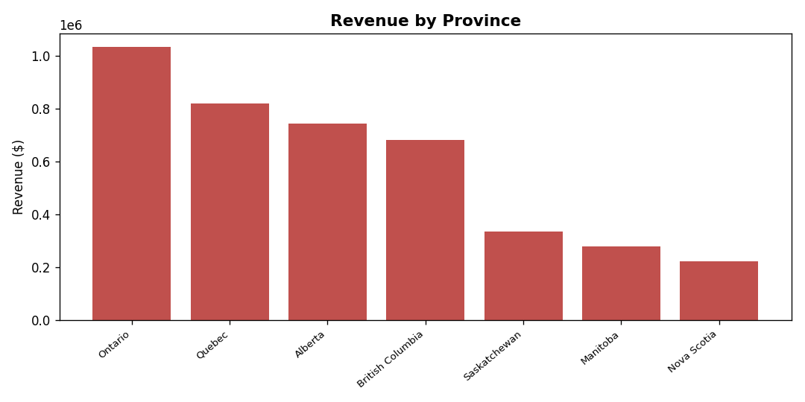

# E-commerce Sales Analysis with SQL

An end-to-end SQL analysis of an online retailer's sales: building a
relational database from raw data, then answering real business
questions about revenue, products, regions, and customer behaviour.

> **Note on the data:** the dataset is **synthetic** — generated by
> `generate_data.py` purely for this portfolio project — so no real
> customers or companies are involved. It is modelled to behave like a
> real store, including seasonal spikes and repeat customers.

---

## What this project does

1. **Generates** a realistic sales dataset (customers, products, orders, order items).
2. **Builds** a normalized SQLite database from that data.
3. **Answers** eight business questions with SQL, using joins, aggregations,
   common table expressions (CTEs), and window functions.
4. **Visualizes** the headline results as charts.

## Tech used

- **SQL (SQLite)** — schema design and all analysis
- **Python** — data generation, loading the database, and charting (`matplotlib`)

---

## Database design

Four related tables in a classic sales model:

```
customers ──< orders ──< order_items >── products
```

A customer places many orders, each order has many line items, and each
line item points to one product. Revenue lives in `order_items`
(`quantity * unit_price`), so most queries join through that table.
Only **completed** orders count toward revenue — cancelled and returned
orders are excluded, because that is the money the business actually kept.

See [`sql/schema.sql`](sql/schema.sql) for the full definitions and
[`sql/analysis.sql`](sql/analysis.sql) for every query.

---

## Key findings

Across two years of activity (2024–2025):

| Metric | Result |
|---|---|
| Total revenue (completed orders) | **$4.11M** |
| Completed orders | 2,714 |
| Paying customers | 537 |
| Average order value | $1,514 |
| Year-over-year growth | **+24%** (2024: $1.83M → 2025: $2.28M) |
| Repeat-purchase rate | **77.5%** of customers ordered more than once |

**Revenue is concentrated in Electronics**, which alone drove about **56%**
of all revenue — more than every other category combined.



**Revenue is seasonal and trending up.** Every November–December shows a
clear holiday spike, and 2025 outperformed 2024 across the board.



**Revenue by province** is led by the regions with the most customers.



---

## A query worth highlighting

Month-over-month growth, using a CTE to total revenue per month and a
`LAG()` window function to compare each month to the one before it:

```sql
WITH monthly AS (
    SELECT strftime('%Y-%m', o.order_date) AS month,
           SUM(oi.quantity * oi.unit_price) AS revenue
    FROM orders o
    JOIN order_items oi ON oi.order_id = o.order_id
    WHERE o.status = 'completed'
    GROUP BY month
)
SELECT month,
       ROUND(revenue, 2) AS revenue,
       ROUND(100.0 * (revenue - LAG(revenue) OVER (ORDER BY month))
             / LAG(revenue) OVER (ORDER BY month), 1) AS pct_change
FROM monthly
ORDER BY month;
```

---

## Run it yourself

Requires Python 3.8+.

```bash
pip install -r requirements.txt   # installs matplotlib

python generate_data.py           # 1. create the CSV data
python build_database.py          # 2. build ecommerce.db
python analysis.py                # 3. print the report + save charts
```

You can also open `ecommerce.db` in [DB Browser for SQLite](https://sqlitebrowser.org/)
and run any query from `sql/analysis.sql` directly.

---

## Project structure

```
ecommerce-sales-sql-analysis/
├── data/                 # synthetic CSV data
│   ├── customers.csv
│   ├── products.csv
│   ├── orders.csv
│   └── order_items.csv
├── sql/
│   ├── schema.sql        # table definitions
│   └── analysis.sql      # 8 business questions + queries
├── charts/               # generated charts (PNG)
├── generate_data.py      # creates the synthetic data
├── build_database.py     # loads the CSVs into SQLite
├── analysis.py           # runs queries, prints report, saves charts
├── requirements.txt
└── README.md
```

## Skills demonstrated

Relational schema design · multi-table `JOIN`s · `GROUP BY` aggregation ·
CTEs · window functions (`LAG`, `SUM OVER`) · filtering business logic
(completed vs cancelled/returned) · translating data into business insights.
